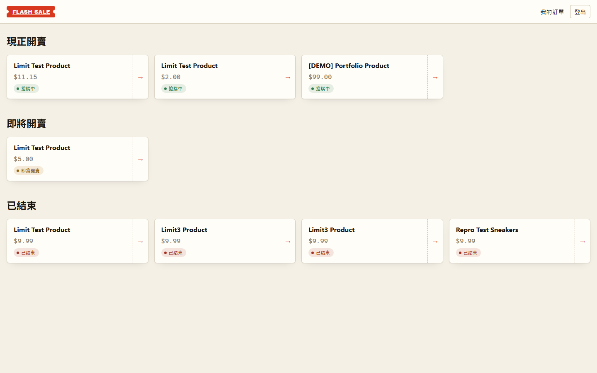
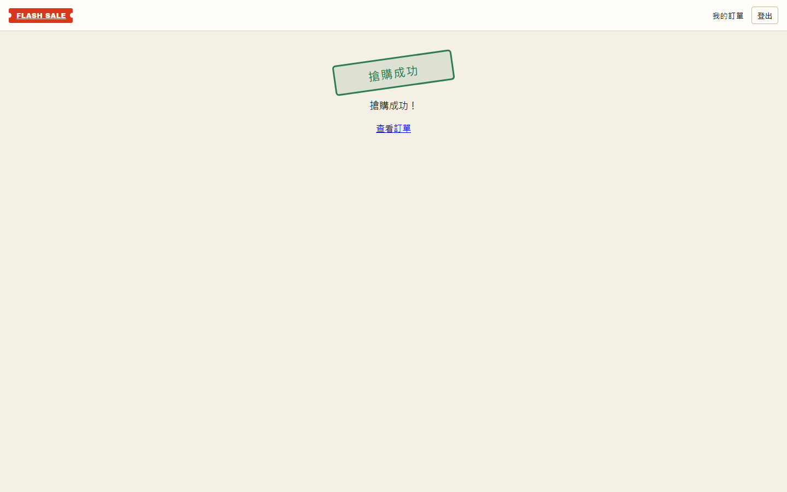
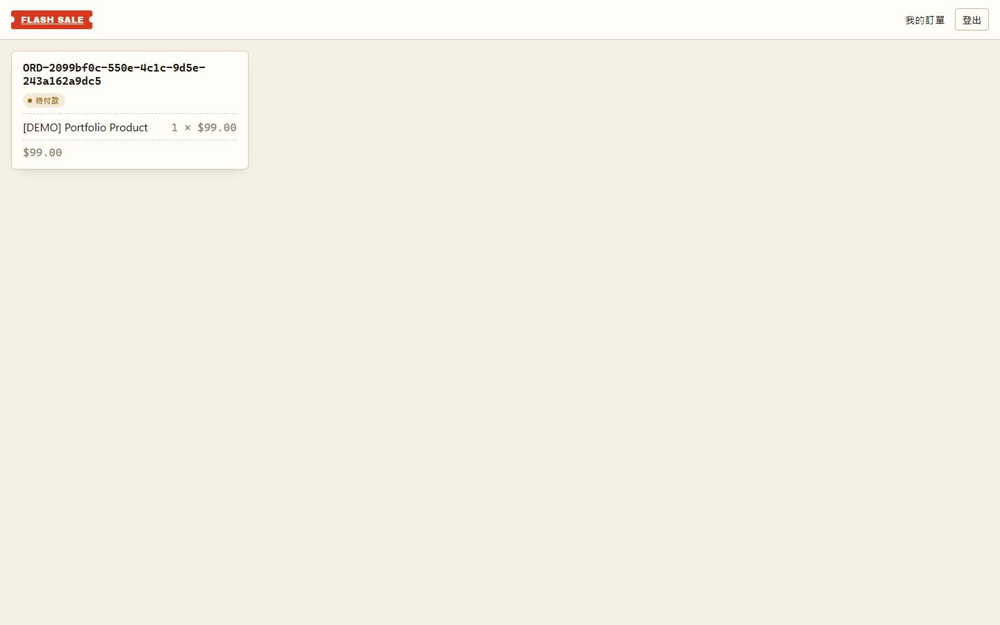
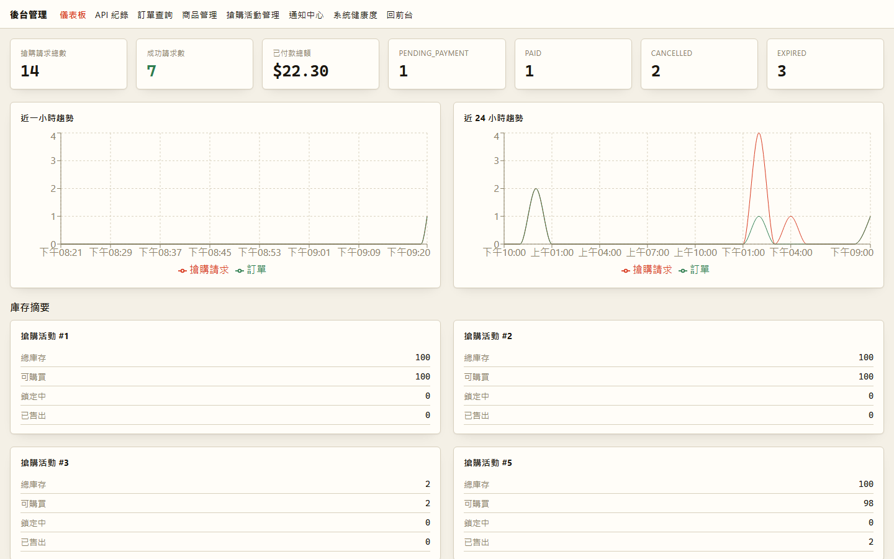
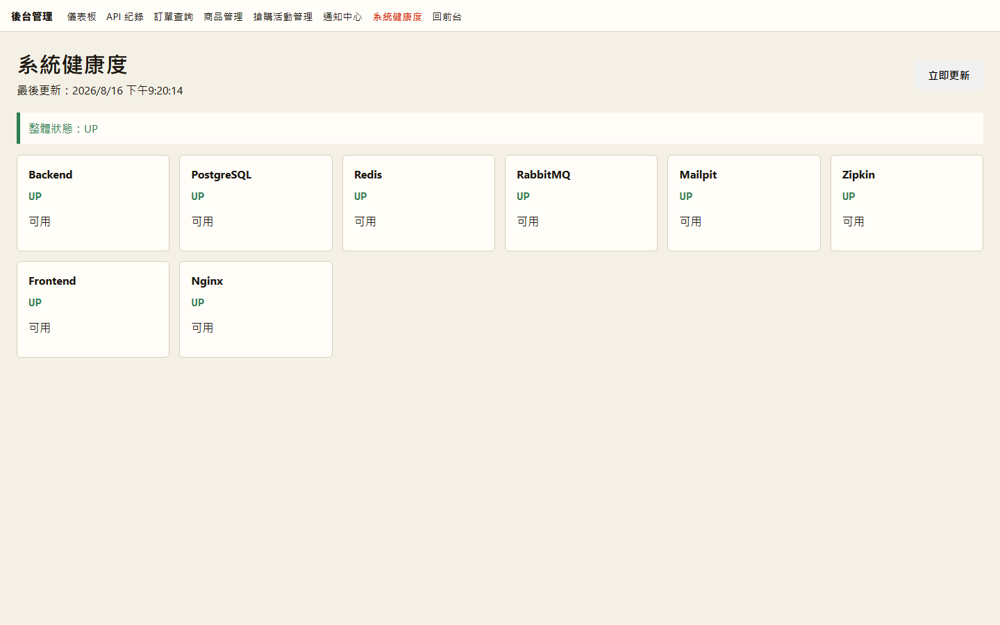
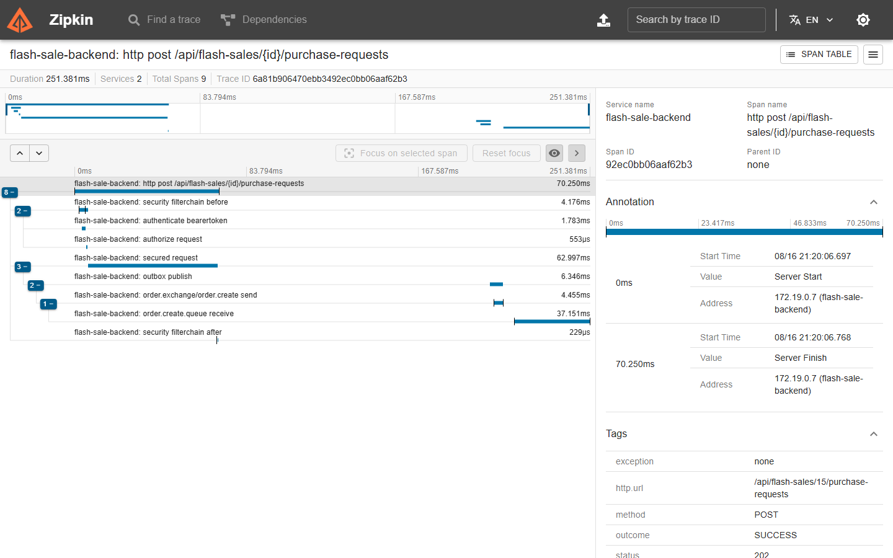
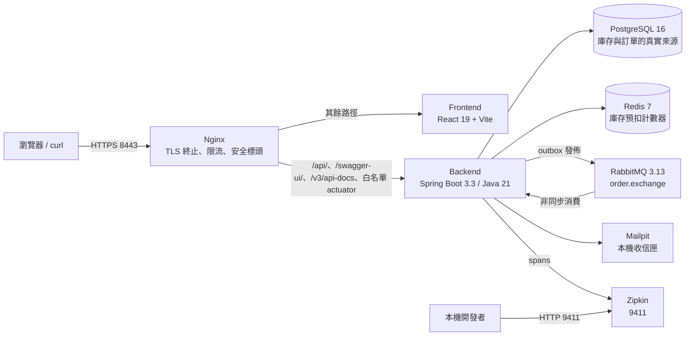
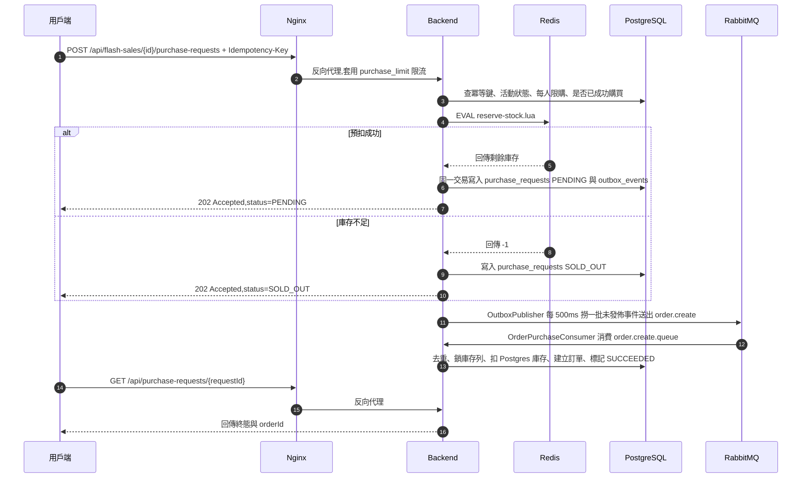

# FlashSale

限量商品搶購系統(作品集專案)。Spring Boot 3.3(Java 21)+ React 19,以 Docker Compose 與本機 k3s 兩種形式交付 8 個服務,
用「Redis Lua 原子預扣 + Transactional Outbox + RabbitMQ 非同步建單」承接搶購瞬間的併發,
目標是**不超賣、不漏賣,而且每一步都留得下證據**。

[](https://github.com/kevintsai1325/FlashSale/actions/workflows/ci.yml)

> 這是作品集專案,不是上線中的商業系統。以下每個數字都來自本機可重現的量測,不是 production 容量或 SLA 承諾。

## 現況與證據

| 面向 | 目前量到什麼 | 出處 |
|---|---|---|
| 自動化測試 | 後端 177 個測試、前端 70 個測試,最後已知全部通過 | [CI](#ci) |
| 穩態負載 | 10 分鐘 soak:6,000 筆訂單全部成立、沒有超賣、沒有 5xx;同步回應中位數 9.5 ms,可觀察到的完成中位數 515 ms | [負載特性報告](docs/portfolio/performance-report.md) |
| 競爭負載 | 30 個買家搶 10 件:同步回應 p95 中位數 58.4 ms;100 個買家搶 30 件:104.1 ms;300 個買家搶 100 件:188.1 ms,連線全數送達、無 TCP 拒絕(各跑五次取中位數) | [負載特性報告](docs/portfolio/performance-report.md) |
| 正確性不變量 | 壓測共 16 次執行、0 次失敗:沒有超賣、沒有重複下單、沒有殘留 `PENDING`、outbox 全部發佈完成、兩條 DLQ 全空 | [結果文件](docs/portfolio/data/benchmark-results.json) |
| 水平擴展 | 開放模型飽和壓測:600 rps 下 3 副本的 accept p95 為 6.9 ms、單副本 130.0 ms;瓶頸指認為 Postgres 連線池,並量到「副本數 × 連線池 > `max_connections`」的硬天花板 | [水平擴展與自動擴縮](docs/portfolio/scaling-and-autoscaling.md) |
| 分散式鎖 | 四種故障模式實測:持鎖者崩潰、租約到期造成雙重執行、Redis 故障、fencing token 的取捨 | [分散式鎖的故障模式](docs/portfolio/distributed-lock-failure-modes.md) |
| 可觀測性 | 一條 trace 串起「HTTP 搶購 → outbox 發佈 → consumer 建單」;後台以 8 項健康度呈現整套環境狀態 | [畫面](#畫面) |

測試數字是**最後已知**的驗證結果,不是產生這份 README 時重新執行的;隨時可以用上面的 CI badge 看最新一次的結果。
後端的整合測試用 Testcontainers,需要可用的 Docker daemon —— 在只有 containerd 的環境
(例如 Rancher Desktop 預設的 containerd 模式)會有約 82 個測試無法初始化,那是環境缺 Docker,不是測試失敗。

壓測的兩個重要邊界:壓力直接打 backend、**不經過 Nginx 與 TLS**,所以真實用戶端看到的延遲會更高;
`completedLatencyMs` 因為是以 250 ms 輪詢觀察,含有最多 +250 ms 的量測偏差。完整說明在
[負載特性報告](docs/portfolio/performance-report.md#三個必須知道的量測偏差)。

## 畫面

六張圖全部取自本機真實執行的環境,沒有合成或修圖;擷取條件、資訊安全檢查與重新產生步驟見
[截圖說明](docs/portfolio/assets/README.md)。

| 前台搶購活動 | 非同步搶購結果 |
|---|---|
|  |  |
| 依「現正開賣 / 即將開賣 / 已結束」分組的活動列表 | 前端輪詢到終態後顯示的搶購成功頁 |

| 我的訂單 | 後台儀表板 |
|---|---|
|  |  |
| 訂單狀態、商品明細快照與總額 | 搶購請求數、訂單狀態分佈、趨勢圖與各活動庫存摘要 |

| 服務健康度 | 分散式追蹤 |
|---|---|
|  |  |
| 4 個核心相依 + 4 個 HTTP 探針,合成 8 項健康度 | 一次搶購的 9 個 span:HTTP → outbox 發佈 → RabbitMQ → consumer 建單 |

## 系統全貌

對外只開兩個埠:Nginx 的 `8443`(HTTPS,唯一正式入口)與 Zipkin 的 `9411`(本機除錯用)。
backend、frontend、PostgreSQL、Redis、RabbitMQ、Mailpit 都沒有 host port。



backend 是模組化單體(modular monolith),依領域切成 `identity`、`catalog`、`flashsale`、`inventory`、
`order`、`payment`、`notification`、`admin` 與共用的 `common`,每個模組再分 `domain` / `application` /
`adapter` 三層,邊界由 ArchUnit 測試強制而不是靠自律。細節見[架構深入說明](docs/portfolio/architecture.md)。

## 核心搶購資料流

搶購 API 是「接受後非同步完成」:HTTP 端只做「能不能買」與 Redis 預扣,真正建立訂單發生在 RabbitMQ consumer,
使用者拿到 `202 Accepted` 與一個 `requestId` 後再輪詢終態。



為什麼這樣切、代價是什麼,寫在[工程取捨](docs/portfolio/trade-offs.md)。

## 快速開始

前置需求:Docker Desktop(或任何能跑 Docker Compose 的環境)、`openssl`、bash。

```bash
# 1. 準備環境變數(JWT 金鑰的產生方式見下方「詳細設定」)
cp .env.example .env

# 2. 產生本機自簽憑證
chmod +x nginx/certs/generate-cert.sh
./nginx/certs/generate-cert.sh

# 3. 啟動 8 個服務並等待全部 healthy
docker compose up --build -d
docker compose ps
```

全部 `healthy` 之後,瀏覽器打開 `https://localhost:8443/`;自簽憑證會跳安全警告,點過去即可。
API 文件在 `https://localhost:8443/swagger-ui/index.html`。

## Demo 資料

`scripts/demo-data.sh` 會建立一組固定識別碼的示範資料(一個一般使用者、一個管理者、一個商品與一場搶購活動),
密碼由你自己指定,不寫死在版控裡;它會先確認 8 個服務都 healthy、Compose 專案與 Docker context 都是本機的正規目標,
確認之後才動手。

```bash
export DEMO_USER_PASSWORD='<自訂的示範密碼>'
export DEMO_ADMIN_PASSWORD='<另一組自訂的示範密碼>'
./scripts/demo-data.sh seed
```

指令結尾會印出示範活動的 flash sale 編號與可直接點開的網址。展示結束後清乾淨(可重複執行,只會刪除固定的示範識別碼):

```bash
./scripts/demo-data.sh cleanup
```

Demo的展示流程(3~5 分鐘)在 [Demo 腳本](docs/portfolio/demo-script.md)。

## 深入文件

| 文件 | 內容 |
|---|---|
| [架構深入說明](docs/portfolio/architecture.md) | 服務責任邊界、搶購資料流、一致性與補償機制、可觀測性、資料模型 |
| [API 操作範例](docs/portfolio/api-examples.md) | 從註冊到付款的完整 `curl` 流程,含冪等鍵與錯誤格式 |
| [工程取捨](docs/portfolio/trade-offs.md) | 每個關鍵決策的理由、代價與失效邊界 |
| [Demo 腳本](docs/portfolio/demo-script.md) | 可照著念的展示流程與備援方案 |
| [負載特性報告](docs/portfolio/performance-report.md) | 16 次實測執行的完整數字、量測偏差與資料品質 |
| [截圖說明](docs/portfolio/assets/README.md) | 六張截圖的擷取條件、資安檢查與重現步驟 |
| [壓測工具](load-tests/benchmark/README.md) | 產生上述數字的隔離 benchmark harness |
| [k6 端到端腳本](load-tests/README.md) | 走完整 Nginx 路徑的壓力測試腳本 |
| [分散式鎖的故障模式](docs/portfolio/distributed-lock-failure-modes.md) | 排程重複執行造成超賣的證據、修復後驗證,以及四種故障模式的實測 |
| [兩種分散式鎖的對照](docs/portfolio/lock-mechanism-comparison.md) | Redisson 與 Kubernetes Lease 在正確性、故障行為與運維上的差異 |
| [量測環境的時鐘準確度](docs/portfolio/wsl2-clock-accuracy.md) | WSL2 VM 時鐘走快約 3.5%:診斷過程、緩解方式,以及哪些數字受影響 |
| [水平擴展與自動擴縮](docs/portfolio/scaling-and-autoscaling.md) | 飽和式壓測的方法、replicas 1/3/5 的吞吐曲線、瓶頸指認、HPA 與預先擴容的對照 |
| [k3s 單節點基準](docs/portfolio/k3s-baseline.md) | Rancher Desktop 可重現操作、目前證據邊界與單機限制 |
| [AWS EC2 k3s 部署](docs/portfolio/aws-ec2-k3s.md) | 單台 EC2 上的 k3s 實際執行結果、OIDC/SSM 的 CD 管線與已知限制 |

## 詳細設定

<details>
<summary>環境變數與 JWT 金鑰</summary>

`.env` 由 `.env.example` 複製而來,已被 gitignore,**不要提交**。backend 沒有預設金鑰,不設定就起不來,
必須自己產生一組 RSA 金鑰對:

```bash
openssl genpkey -algorithm RSA -pkeyopt rsa_keygen_bits:2048 -out jwt-private.pem
openssl rsa -in jwt-private.pem -pubout -out jwt-public.pem
```

接著把兩個 `.pem` 檔的完整內容(含 PEM 首尾的標記行)分別填進 `.env` 裡的 `JWT_PRIVATE_KEY` 與
`JWT_PUBLIC_KEY` 兩個變數,值用雙引號包起來,允許跨多行。產生出來的 `.pem` 檔請放在 repo 之外,或用完即刪。

`GMAIL_USERNAME` 與 `GMAIL_APP_PASSWORD` 本機可以留空:註冊信會被 Mailpit 攔下來,不會真的寄出。

</details>

<details>
<summary>本機自簽 TLS 憑證</summary>

Nginx 需要 `nginx/certs/localhost.crt` 與 `nginx/certs/localhost.key`,由 `nginx/certs/generate-cert.sh`
產生一次即可(兩個檔案都被 gitignore,不要提交)。

- **curl**:加 `-k` 略過驗證,例如 `curl -k https://localhost:8443/`。
- **瀏覽器**:第一次進站會看到安全警告,本機開發直接點過去;想消掉警告就把 `localhost.crt` 匯入作業系統或瀏覽器的信任清單。
- **Windows 的 Git Bash**:MSYS 會把腳本裡的 `/CN=localhost` 誤轉成檔案系統路徑而讓 `openssl` 失敗,
  遇到 `req: subject name is expected to be in the format ...` 時,在指令前面加上 `MSYS_NO_PATHCONV=1`。

</details>

<details>
<summary>查看寄出的信件(Mailpit)</summary>

Mailpit 沒有對 host 開埠,瀏覽器直接開 `http://localhost:8025` 是連不上的。改成從容器內部查:

```bash
docker compose exec mailpit sh -c "wget -qO- http://localhost:8025/api/v1/messages"
```

</details>

<details>
<summary>把帳號升級成 ADMIN</summary>

前端的 `/admin/*` 路由(儀表板、訂單、商品與活動維護、API 稽核紀錄、通知管理、服務健康度)只有 `ADMIN` 角色進得去,
一般使用者或未登入者會被導回首頁。先用一般註冊流程建立帳號,再直接改資料庫:

```bash
docker compose exec postgres psql -U flashsale -d flashsale \
  -c "UPDATE users SET role = 'ADMIN' WHERE email = 'you@example.com';"
```

`role` 是簽發 access token 當下就寫進 JWT 的 claim,所以升級後**必須重新登入**,新的 token 才會帶 `ROLE_ADMIN`。
重新登入後打開 `https://localhost:8443/admin`。

</details>

<details>
<summary>可觀測性端點</summary>

- **Actuator**:`nginx/nginx.conf` 只反向代理一份白名單——`/actuator/health`、`/actuator/health/liveness`、
  `/actuator/health/readiness`、`/actuator/metrics` 與 `/actuator/metrics/{name}`;其餘 `/actuator/` 路徑一律回 404。
  `/actuator/metrics` 系列需要 `ADMIN` 角色的 JWT,兩個 health 端點則是公開的(`readiness` 涵蓋 `db`、`redis`、`rabbit`)。
- **Zipkin**:`http://localhost:9411/zipkin/`(本機除錯用,不經 Nginx)。`OutboxWriter` 會把當下 span 的
  traceId/spanId 存進 `outbox_events.trace_context`,`OutboxPublisher` 再用它續上 parent context,
  所以「HTTP 搶購請求 → outbox 發佈 → consumer 建單」會落在同一條 trace 上。
- **結構化日誌**:`docker compose logs backend` 每一行都是帶 `traceId` / `spanId` 的 JSON,可以用 `jq` 過濾,
  也可以拿回應標頭 `X-Trace-Id` 的值回頭比對 Zipkin 與後台稽核紀錄。
- **自訂搶購指標**:`purchase.reservation`、`purchase.reservation.latency`、`purchase.order.created`,
  可透過 `/actuator/metrics/{name}` 查詢。
- **服務健康度**:後台的 `GET /api/admin/system-health` 把 4 個核心相依與 4 個 HTTP 探針合成一張快照。

</details>

<details>
<summary>壓力測試與重現這次量測</summary>

走完整 Nginx 路徑的 k6 腳本與資料準備方式見 [`load-tests/README.md`](load-tests/README.md)。

作品集裡的數字則由隔離的 benchmark harness 產生(獨立的 Compose 專案、獨立 volume 與 port),
重跑一次:

```powershell
powershell -ExecutionPolicy Bypass -File load-tests/benchmark/collect.ps1 -Mode full
```

任何時候都可以重新驗證既有的結果文件:

```powershell
node load-tests/benchmark/verify-results.mjs docs/portfolio/data/benchmark-results.json
```

</details>

## 已知限制

誠實揭露,不用「未來會做」帶過:

- **本機自簽 TLS**:Nginx 用自簽憑證在 `8443` 終止 TLS,瀏覽器與 `curl` 都會警告;沒有正式憑證鏈、
  自動續期、HSTS 或 OCSP stapling。
- **部署限於單節點**:交付形式是 Docker Compose 與本機 k3s(Rancher Desktop),另有單台 EC2 的 k3s 實測;
  沒有多節點叢集,也沒有 Prometheus / Grafana 這類集中式監控與告警。PodDisruptionBudget、節點排空這類
  「多節點才有意義」的機制只驗證得了它會不會動,驗證不了它實際保護到什麼。
- **量測邊界**:數字來自一台開發機、一次收集,壓測直接打 backend 而不經過 Nginx 與 TLS,而且**沒有加壓到飽和**,
  所以這一節沒有任何一個數字可以當成吞吐量上限。飽和點是另一次量測,見
  [水平擴展與自動擴縮](docs/portfolio/scaling-and-autoscaling.md),但那是單節點、放寬 `max_connections` 之後的結果,
  一樣不是 production 容量或 SLA。soak 有偶發的尾端延遲離群值
  (accepted p95 仍在 12.3 ms,但 max 到 130 ms),原因未查,解讀方式見
  [負載特性報告](docs/portfolio/performance-report.md#離群值與資料品質)。
- **沒有做任何比較**:報告只描述目前這套系統在這些條件下量到什麼,沒有跟早期實作、其他專案或其他系統對比。
- **付款是模擬的**:由請求指定成功或失敗,沒有串接任何金流服務;通知只有 email 一種通道,本機由 Mailpit 攔截。
- **DLQ 沒有自動重放**:進到 DLQ 的訊息沒有重放工具,需要人工處理。

## CI

[](https://github.com/kevintsai1325/FlashSale/actions/workflows/ci.yml)

GitHub Actions 在每次 push 到 `main` 或開 PR 時,平行執行 backend(`./gradlew test`,涵蓋
unit / application / integration / API / ArchUnit 測試)與 frontend(lint、型別檢查、build、vitest)兩個 job。
CI 只驗證 build + test 通過,不包含映像檔建置、推送或部署。
