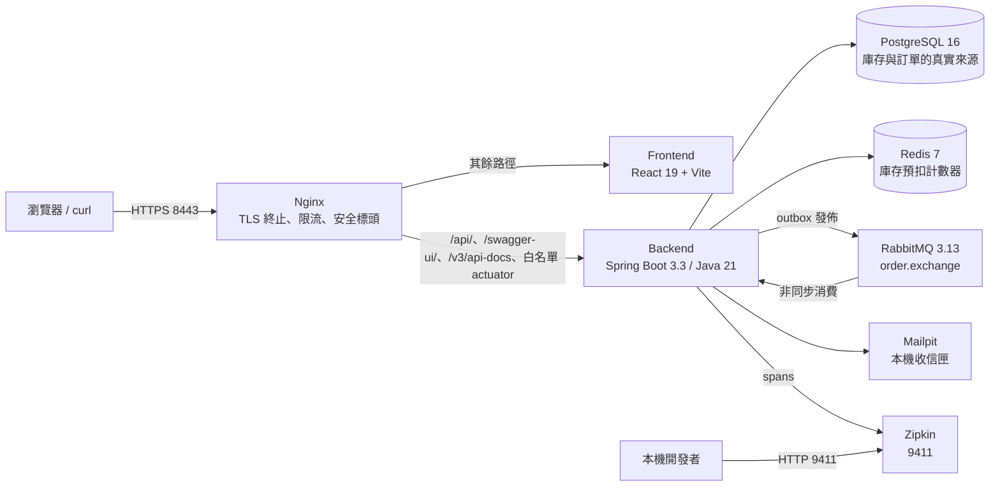
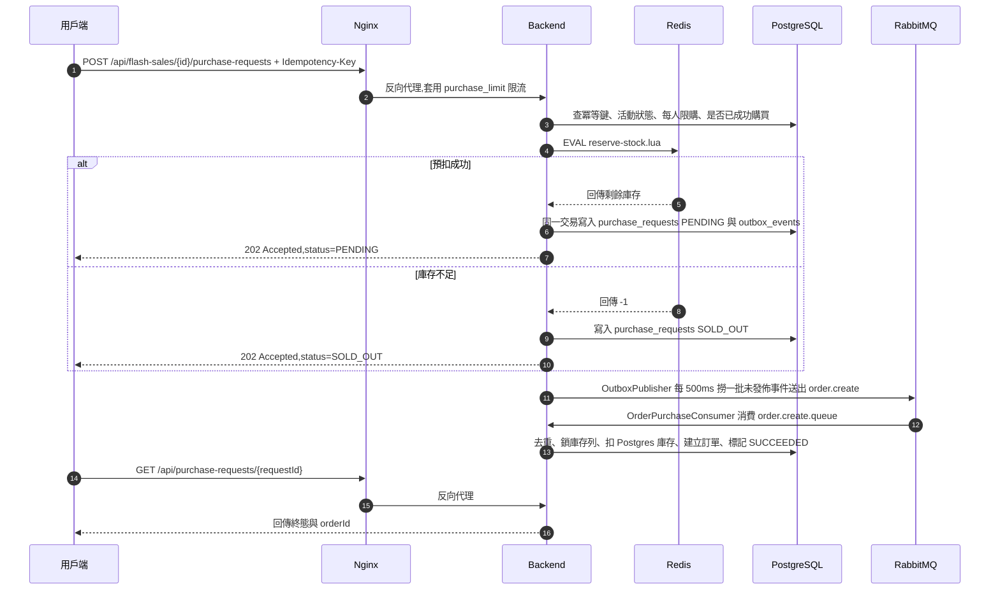

# FlashSale 架構深入說明

本文說明 FlashSale 目前在 `main` 上實際跑起來的架構:服務怎麼切、搶購請求怎麼流動、
一致性靠什麼機制維持,以及出問題時能從哪裡看到證據。所有敘述都對應到目前的程式碼與
[`compose.yaml`](../../compose.yaml),而不是設計階段的構想。

相關文件:[API 操作範例](./api-examples.md)、[工程取捨](./trade-offs.md)、[Demo 腳本](./demo-script.md)。

## 系統全貌

整個系統以 Docker Compose 交付,共 8 個服務。對外只開兩個埠:Nginx 的 `8443`(HTTPS,
唯一的正式入口)與 Zipkin 的 `9411`(本機除錯用)。backend、frontend、PostgreSQL、Redis、
RabbitMQ、Mailpit 都沒有 host port,只能從 Compose 內部網路存取。

## 服務責任邊界

| 服務 | 對外埠 | 責任 | 不負責 |
|---|---|---|---|
| `nginx` | `8443` | TLS 終止(自簽憑證)、反向代理、`limit_req` 限流、CSP 等安全標頭、`/actuator/` 白名單以外一律 404 | 認證與授權決策 |
| `frontend` | 無 | React 19 + Vite + TypeScript SPA,前台搶購與 `/admin/*` 後台頁面 | 任何商業規則 |
| `backend` | 無 | 全部業務邏輯:認證、活動、庫存預扣、訂單、付款、通知、後台查詢、稽核 | 靜態資源伺服 |
| `postgres` | 無 | 庫存、訂單、purchase request、outbox、稽核紀錄的唯一真實來源 | 高併發熱點計數 |
| `redis` | 無 | 搶購瞬間的庫存預扣計數器(Lua 原子腳本) | 最終一致性的權威值 |
| `rabbitmq` | 無 | `order.exchange` 直連交換器、建單與釋放庫存兩條佇列及其 DLQ | 訊息去重(由 DB 負責) |
| `mailpit` | 無 | 攔截註冊等通知信,避免本機 demo 寄出真實郵件 | 正式郵件投遞 |
| `zipkin` | `9411` | 收集 Micrometer Tracing/Brave 送出的 span | 指標與日誌儲存 |

backend 內部是模組化單體(modular monolith),依領域切成 `identity`、`catalog`、`flashsale`、
`inventory`、`order`、`payment`、`notification`、`admin` 與共用的 `common`;每個模組再分
`domain` / `application` / `adapter` 三層。邊界不是靠自律,而是由 ArchUnit 測試強制:
`domain` 不得依賴 `adapter`、`domain` 不得依賴任何 Spring 類別,模組之間也不得直接依賴
別的模組的 `adapter` 層。

Nginx 的路由規則([`nginx/nginx.conf`](../../nginx/nginx.conf))可以摘要成四類:

- `/api/auth/login`、`/api/auth/register`:套用 `auth_limit`(5r/s、burst 10、nodelay)。
- `/api/flash-sales/{id}/purchase-requests`:套用 `purchase_limit`(50r/s、burst 100、nodelay)。
- `/api/`、`/swagger-ui/`、`/v3/api-docs`、`/actuator/health`、`/actuator/health/liveness`、
  `/actuator/health/readiness`、`/actuator/metrics` 與 `/actuator/metrics/{name}`:直接反向代理到 backend。
- 其餘 `/actuator/` 路徑一律回 404,剩下的路徑交給 frontend。

## 核心搶購資料流

搶購 API 是「接受後非同步完成」的設計:HTTP 端只做「能不能買」與「Redis 預扣」,真正建立訂單
發生在 RabbitMQ consumer。使用者拿到 `202 Accepted` 與一個 `requestId`,再輪詢終態。

幾個關鍵細節:

- **冪等鍵**:`Idempotency-Key` 標頭與 `(userId, flashSaleId)` 一起查詢 `purchase_requests`;
  重送同一把鍵會直接回傳既有的 request,不會重複預扣。
- **Redis 預扣**:[`reserve-stock.lua`](../../backend/src/main/resources/redis/reserve-stock.lua)
  在單一原子腳本內完成 `GET` 與 `DECRBY`。回傳剩餘量代表成功,`-1` 代表庫存不足,
  `-2` 代表 key 不存在——此時 backend 會從 Postgres 重新灌入庫存(`SETNX`)並重試一次,
  仍失敗才回 `503 STOCK_GATEWAY_UNAVAILABLE`。
- **每人限購**:活動的 `purchase_limit_per_user` 在 HTTP 端檢查;已經有成功紀錄的使用者
  會拿到 `REJECTED` 而不是再預扣一次。
- **outbox 與業務資料同一個交易**:`purchase_requests` 與 `outbox_events` 一起 commit,
  所以不會出現「請求已收下但訊息沒送出」的空窗。
- **建單在 consumer**:`OrderPurchaseConsumer` 以 `SELECT ... FOR UPDATE` 鎖住 `inventory` 列後
  才扣 Postgres 庫存,建立 `PENDING_PAYMENT` 訂單(付款期限 15 分鐘),並把商品名稱快照寫進
  `order_items.product_name`,之後改商品名不會影響歷史訂單。

## 一致性與補償機制

系統橫跨 Redis、PostgreSQL 與 RabbitMQ,沒有使用分散式交易,而是用「本地交易 + outbox +
冪等消費 + 補償」把不一致收斂掉。

- **Transactional outbox**:`OutboxWriter` 在業務交易內寫入 `outbox_events`(含 `trace_context` JSONB 欄位)。
  `OutboxPublisher` 以 `@Scheduled(fixedDelay = 500)` 每批最多 50 筆、用 `FOR UPDATE` 撈出未發佈事件,
  送到 `order.exchange`,routing key 為 `order.create` 或 `stock.release`,並在訊息標頭帶上 `outboxEventId`。
- **冪等消費**:兩個 consumer 都先呼叫 `ConsumedMessageGuard.tryConsume(outboxEventId, consumerName)`,
  靠 `consumed_messages` 的唯一鍵做「插入成功才處理」,重送的訊息會被直接略過。
- **重試與 DLQ**:listener 重試 3 次(初始 1s、倍率 2、上限 10s),`default-requeue-rejected: false`,
  最終失敗的訊息經 `x-dead-letter-exchange` 進入 `order.create.queue.dlq` 或 `stock.release.queue.dlq`,
  不會無限重投。
- **補償而非回滾**:取消訂單、付款失敗與付款逾時都走 `OrderCompensationService`——先在 Postgres
  釋放庫存並記錄 `order_status_history`,再寫一筆 `STOCK_RELEASE_REQUESTED` outbox 事件;
  `StockReleaseConsumer` 收到後把 Redis 計數器加回去。
- **排程守門員**:
  - `PaymentTimeoutScheduler`(每 30 秒)把逾期未付款的訂單標成 `EXPIRED` 並補償庫存。
  - `InventoryReconciliationScheduler`(每 60 秒)比對可購買活動的 Redis 值與 Postgres 值,
    不一致就以 Postgres 為準覆寫 Redis,並留下 warn 日誌。
  - `NotificationRetryScheduler`(每 60 秒)重試失敗的通知投遞。
  - `ApiAuditRetentionScheduler`(每天 03:00)刪除超過 30 天的稽核紀錄。

訂單狀態機只有四種狀態:`PENDING_PAYMENT` → `PAID` / `CANCELLED` / `EXPIRED`,而且只有
`PENDING_PAYMENT` 可以轉移;其他情況會丟出帶 `code` 的 409。付款失敗與使用者主動取消共用
`CANCELLED` 終態,兩者的差別記在 `payment_records`。

## 可觀測性與稽核

- **Trace**:Micrometer Tracing + Brave,sampling 固定為 1.0,span 送到 Zipkin
  (`http://zipkin:9411/api/v2/spans`)。`OutboxWriter` 會把當下 span 的 traceId/spanId 存進
  `outbox_events.trace_context`;`OutboxPublisher` 用它建立 parent context 再開 `outbox publish` span,
  加上 RabbitMQ 的 `observation-enabled`,所以「HTTP 搶購請求 → outbox 發佈 → consumer 建單」
  會落在同一條 trace 上。
- **Trace id 回傳**:`ApiAuditFilter` 會把 trace id 寫進回應標頭 `X-Trace-Id`,可以直接拿去
  Zipkin 或後台稽核頁查同一次請求。
- **API 稽核**:同一個 filter 註冊在 Spring Security 過濾鏈中 `SecurityContextHolderFilter` 之後,
  所以連 401/403 也會被記錄。每個請求寫一列 `api_audit_logs`(method、路徑樣板、狀態碼、userId、
  traceId、耗時、來源 IP、User-Agent、錯誤碼),寫入透過 `ApiAuditWriter` 交給 `@Async` 執行,
  不佔用請求執行緒;writer 內部維護 pending 計數,提供「等待寫入排空」的屏障給本機 demo 清理工具使用。
  filter 從不讀取 Authorization 標頭、密碼或請求/回應本體,以 `internal` 為前綴的本機工具端點則完全跳過。
- **結構化日誌**:logback 以 `LogstashEncoder` 輸出 JSON,每行都帶 `traceId` 與 `spanId`,
  可以用 trace id 把 Zipkin 與 `docker compose logs backend` 串起來。
- **指標**:Actuator 只暴露 `health`、`info`、`metrics`。自訂搶購指標有三個:
  `purchase.reservation`(tag `outcome=reserved|insufficient_stock|error`)、
  `purchase.reservation.latency`(Redis 預扣延遲)、`purchase.order.created`(consumer 實際建立的訂單數)。
- **健康度**:`/actuator/health/liveness` 與 `/actuator/health/readiness` 為公開端點(readiness 包含
  `db`、`redis`、`rabbit`);`/actuator/metrics` 系列則需要 `ADMIN` 角色。後台的
  `GET /api/admin/system-health` 會把 4 個核心指標(Backend readiness、PostgreSQL、Redis、RabbitMQ)
  與 4 個 HTTP 探針(Mailpit、Zipkin、Frontend、Nginx)合成一張 8 項健康度快照。

## 資料模型重點

Flyway 管理 schema(`ddl-auto: validate`,啟動時只驗證不改結構),目前共 3 個 migration。
主要資料表與它們在流程中的角色:

| 資料表 | 角色 |
|---|---|
| `users` / `refresh_tokens` | 帳號與 refresh token(僅存雜湊值,30 天有效) |
| `products` / `flash_sales` / `inventory` | 商品、搶購活動與權威庫存(含 `version` 樂觀鎖欄位) |
| `purchase_requests` | 搶購請求與冪等鍵,狀態為 `PENDING`/`SUCCEEDED`/`SOLD_OUT`/`REJECTED`/`FAILED` |
| `orders` / `order_items` / `order_status_history` | 訂單、商品明細快照與狀態轉移紀錄 |
| `payment_records` | 每次付款嘗試的結果(`SUCCESS`/`FAILURE`) |
| `outbox_events` | 交易性 outbox,含 `trace_context` JSONB 與未發佈事件的部分索引 |
| `consumed_messages` | 消費端去重表 |
| `notification_deliveries` | 通知投遞狀態與重試次數 |
| `api_audit_logs` | 每個 API 請求一列的稽核紀錄 |

存取層採 Spring Data JPA,並在 `application.yml` 明確關閉 OSIV(`spring.jpa.open-in-view: false`),
理由與代價寫在[工程取捨](./trade-offs.md#關閉-osiv)。
