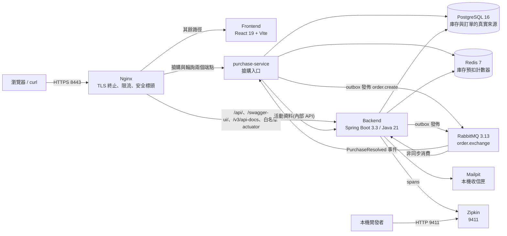
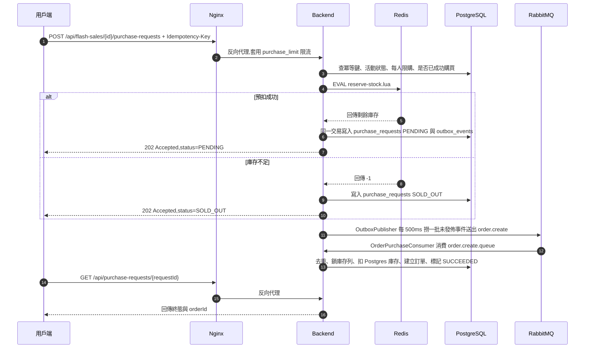

# FlashSale 架構深入說明

本文說明 FlashSale 目前在 `main` 上實際跑起來的架構:服務怎麼切、搶購請求怎麼流動、
一致性靠什麼機制維持,以及出問題時能從哪裡看到證據。所有敘述都對應到目前的程式碼與
[`compose.yaml`](../../compose.yaml),而不是設計階段的構想。

相關文件:[API 操作範例](./api-examples.md)、[工程取捨](./trade-offs.md)、[Demo 腳本](./demo-script.md)。

## 系統全貌

整個系統共 9 個服務,以 Docker Compose 與本機 k3s 兩種形式交付。對外只開兩個埠:
Nginx 的 `8443`(HTTPS,唯一的正式入口)與 Zipkin 的 `9411`(本機除錯用)。其餘服務都沒有
host port,只能從內部網路存取。

搶購的 HTTP 入口自 P4 起由獨立的 `purchase-service` 承接,其餘業務仍在 `backend`
這個模組化單體裡。**這次拆分沒有解決任何效能問題,也不是為了解決效能問題** ——
拆分後多了一次跨行程呼叫,只會更慢。它換到的是服務邊界與獨立部署,付出的代價寫在
[服務拆分的代價](#服務拆分的代價p4)。



## 服務責任邊界

| 服務 | 對外埠 | 責任 | 不負責 |
|---|---|---|---|
| `nginx` | `8443` | TLS 終止(自簽憑證)、反向代理、`limit_req` 限流、CSP 等安全標頭、`/actuator/` 白名單以外一律 404 | 認證與授權決策 |
| `frontend` | 無 | React 19 + Vite + TypeScript SPA,前台搶購與 `/admin/*` 後台頁面 | 任何商業規則 |
| `backend` | 無 | 認證、活動、訂單、付款、通知、後台查詢、稽核;以及建單與庫存扣減的消費端 | 搶購的 HTTP 入口、靜態資源伺服 |
| `purchase-service` | 無 | 搶購的兩個端點:接受搶購請求(冪等鍵、限購、Redis 預扣、寫 outbox)與輪詢終態 | 建單、庫存的真實來源、活動資料的所有權 |
| `postgres` | 無 | 庫存、訂單、purchase request、outbox、稽核紀錄的唯一真實來源 | 高併發熱點計數 |
| `redis` | 無 | 搶購瞬間的庫存預扣計數器(Lua 原子腳本) | 最終一致性的權威值 |
| `rabbitmq` | 無 | `order.exchange` 直連交換器、建單與釋放庫存兩條佇列及其 DLQ | 訊息去重(由 DB 負責) |
| `mailpit` | 無 | 攔截註冊等通知信,避免本機 demo 寄出真實郵件 | 正式郵件投遞 |
| `zipkin` | `9411` | 收集 Micrometer Tracing/Brave 送出的 span | 指標與日誌儲存 |

backend 內部是模組化單體(modular monolith),依領域切成 `identity`、`catalog`、`flashsale`、
`inventory`、`order`、`payment`、`notification`、`admin` 與共用的 `common`;每個模組再分
`domain` / `application` / `adapter` 三層。邊界不是靠自律,而是由 ArchUnit 測試強制:
`domain` 不得依賴 `adapter`、`domain` 不得依賴任何 Spring 類別,模組之間也不得直接依賴
別的模組的 `adapter` 層。

Nginx 的路由規則([`nginx/nginx.conf`](../../nginx/nginx.conf))可以摘要成四類:

- `/api/auth/login`、`/api/auth/register`:套用 `auth_limit`(5r/s、burst 10、nodelay)。
- `/api/flash-sales/{id}/purchase-requests` 與 `/api/purchase-requests/{requestId}`:
  反向代理到 `purchase-service`;前者套用 `purchase_limit`(50r/s、burst 100、nodelay)。
- `/internal/`:一律 404。服務之間的內部 API 走叢集內部的 Service 名稱,不經過 Nginx。
- `/api/`、`/swagger-ui/`、`/v3/api-docs`、`/actuator/health`、`/actuator/health/liveness`、
  `/actuator/health/readiness`、`/actuator/metrics` 與 `/actuator/metrics/{name}`:直接反向代理到 backend。
- 其餘 `/actuator/` 路徑一律回 404,剩下的路徑交給 frontend。

## 服務拆分的代價(P4)

把搶購入口拆成獨立服務之後,系統多了三個拆分前不存在的失效模式。它們都是刻意接受的,
不是疏漏,所以逐一寫出來:

**1. 搶購依賴一次同步的跨服務呼叫。** purchase-service 需要活動資料(起訖時間、每人限購、
商品與售價)才能決定要不要放行,那份資料的所有權在 backend。這是唯一新增的同步依賴,
而且它在熱路徑上,還被包在資料庫交易裡 —— 一次慢的呼叫會把交易一起拖長。
因此逾時預算(連線 500 ms、讀取 1000 ms)同時也是那個交易長度的上限。

**2. 「backend 掛掉時搶購還能不能開」變成一個要回答的問題。** 答案是:活動資料快取 2 秒,
下游失敗時用 60 秒寬限期內的過期快取繼續放行,超過寬限期回 `503`。
所以已經在搶的活動有 60 秒緩衝,而**沒有被搶過的活動一開始就開不起來**。
實作與六條對應的測試在 `purchase-service` 的 `CachingFlashSaleClient`。
快取的代價也要講清楚:後台把活動提前結束之後,最多 2 秒內仍可能有請求被放行。

**3. 搶購結果變成最終一致。** 拆分前 consumer 建完單就直接把 `purchase_requests` 改成
`SUCCEEDED`;拆分後 backend 發一個 `PurchaseResolved` 事件,由 purchase-service 更新自己的
資料。使用者輪詢到終態的時間因此多了一段訊息延遲,`completedLatencyMs` 不能與拆分前直接比較。

步驟 1 刻意**不**走的捷徑:當時兩個服務共用同一個 PostgreSQL,讓 backend 直接寫
`purchase_requests` 是能動的,而且更簡單。不這樣做的理由是那會讓同一張表有兩個寫入者,
拆庫時一定要整個重做。因為寫入權責從一開始就只有一個,步驟 2 只需要換掉儲存位置。

兩個服務各自複製了一份 outbox 機制、佇列名稱常數、錯誤回應格式與 JWT 驗證設定。
刻意不抽共用 library:服務之間該共用的是契約(事件的 JSON 形狀、HTTP API),不是型別。

## 每個服務一個資料庫(P4 步驟 2)

purchase-service 自 2026-09-15 起連的是自己的 PostgreSQL instance(`postgres-purchase`),
不是同一個 instance 的第二個 database。**這個區別是重點**:database per service 的價值
不在資料放在不同檔案裡,而在移除跨服務直接讀寫的可能性。共用 instance 只是把耦合藏進
連線字串,第一個趕工的人就會把跨庫查詢加回來。雲端上這個選擇對應的是每個服務一個 RDS。

拆庫逼著三處跨庫讀取各自找到答案,而三處的答案不一樣 —— 這是這一步最值得學的部分:

| 原本的讀取 | 性質 | 解法 |
|---|---|---|
| 補償流程從 `orderId` 反查 `flashSaleId` | 需要的是「當下這筆的事實」 | **去正規化**:事件裡帶著 `flashSaleId`,建單時存進 `orders` |
| 後台訂單詳情的搶購請求區塊 | 可以從既有資料推導 | **推導**:訂單存在本身就是搶購成功的證明 |
| 儀表板的搶購請求統計 | 需要的是「別人那邊的當前統計」 | **跨服務查詢**:呼叫 purchase-service 的內部端點,失敗時該區塊降級成 0 |

新 schema 沒有任何外鍵指向別的服務的資料:`user_id`、`flash_sale_id`、`order_id` 都只是數字。
跨服務的參照完整性從此由流程(事件、補償)保證,不再由資料庫保證。

拆庫也還回了 outbox 模式原本的意義。共用資料庫時「事件與業務資料在同一個本地交易裡」
其實是勉強成立的 —— 交易確實是同一個,但那個資料庫不屬於 purchase-service。

### 一個只有真的部署才會出現的錯誤

拆庫後第一次跑完整流程,搶購請求卡在 `PENDING`:佇列與 DLQ 全空、outbox 顯示已發佈,
訊息確實送出去了,卻沒有訂單。原因是**去重鍵**:消費端的 `consumed_messages` 存的是
「發佈端 outbox 表的 BIGSERIAL id」。共用一張表時那個數字唯一;拆庫之後 purchase-service
的 outbox 從 1 重新開始,而 backend 那張表裡早就有 `message_id='1'`,第一筆建單事件
因此被認成重複投遞、安靜地丟掉。

修法是讓事件帶自己的 UUID(發佈端產生、跟著訊息走、消費端拿它去重),識別碼不再依賴
任何一個資料庫的序號 —— 這也是 CloudEvents 的 `id` 欄位在做的事。

**三種測試都抓不到它**:單元測試各自挑自己的 id,整合測試每次清空資料庫,契約測試不碰資料。
只有「在一個有歷史資料的環境上真的部署」才會撞到。這是拆分類工作最典型的一種錯誤。

## 四個服務，四個資料庫（P5）

| 服務 | 擁有什麼 | 副本 |
|---|---|---|
| platform（原 backend） | 身分、商品、活動、通知、後台端點、API 稽核 | 3 |
| purchase-service | 搶購請求（含冪等鍵）、Redis 預扣 | 3 |
| order-service | **訂單、訂單明細、狀態歷程、付款紀錄、庫存** | 2 |
| analytics-service | 從 Kafka 事件算出來的讀取模型 | 1 |

### 整個邊界只由一個約束決定

**不超賣的保證是「鎖住庫存列」與「建立訂單」在同一個本地交易裡。**
把這兩件事拆到兩個資料庫，那個保證就得換成分散式交易或補償 ——
而補償無法防止超賣，它只能在事後修正。所以庫存跟著訂單走，沒有別的選擇。

其餘的邊界都是這個決定的後果，而不是獨立的設計：

| 後果 | 處理 | 為什麼是這個處理 |
|---|---|---|
| 店面列表要顯示庫存 | 跨服務**批次**查詢 | 一次呼叫換成 N 次是拆分後最容易寫出來的效能退化，而它在單機開發時完全看不出來 |
| 後台訂單清單／詳情 | BFF：端點留在 platform，資料來自 order-service | 這個畫面還要併上 platform 自己的稽核紀錄；端點搬走就得換成 order-service 去查別人的稽核表 |
| 建立活動 = 跨服務寫入 | 遠端先成功、本地再提交 | 壞掉時留下「沒有活動指向它的庫存」（無害的孤兒），而不是「有活動、沒庫存」（使用者一搶就失敗） |
| 庫存對帳要「進行中的活動」 | 反向呼叫 platform，失敗時整輪跳過 | 拿不到清單時去猜「全部活動」，會把已結束的活動重新種回 Redis |
| 系統健康 | 三個兄弟服務用 HTTP 探測，且不計入總體狀態 | analytics 是純讀取的旁路，它壞掉就讓整個儀表板變紅的警報很快會被無視 |

### platform 從此不收發任何訊息

RabbitMQ、Kafka、outbox、去重表全部跟著流程搬走了。這是拆分做對了的一個徵兆：
剩下的職責（身分、商品、活動、通知、後台）本來就都是同步的請求／回應。
留著一組沒有人用的 outbox 機制，只會讓下一個人以為這裡還有非同步流程。

`ArchitectureTest` 的模組清單與 `FlywayMigrationIT` 的資料表清單因此也是
「platform 還擁有什麼」的權威說明。後者刻意用精確比對：漏刪與搬一半一樣危險。

### 混沌測試：砍掉 order-service，資料仍然對得起來

`scripts/k8s/chaos-order-service.sh` 在二十筆搶購進行到一半時
`kubectl delete pod --force --grace-period=0` 掉全部的 order-service 副本，
然後等系統自己收斂，再驗四個不變量。

用 `--force` 是刻意的：優雅關閉會讓消費端把手上的訊息處理完，那是「下線」不是「當掉」。
被強制砍掉時未 ack 的訊息會回到佇列，由重啟後的副本接手 —— 這個測試證明的是
**補償與重試真的有用**，而不是「系統沒壞」。

實測結果（2026-09-15，20 筆／庫存 30）：

```
purchase requests: SUCCEEDED=20 SOLD_OUT=0 FAILED=0 PENDING=0
orders=20  inventory total=30 available=10 sold=20  dlq_depth=0
```

四個不變量全過：沒有請求停在 `PENDING`、訂單數等於成功的請求數、
`available + sold == total`、三條 DLQ 全空。

### 讀取模型與權威資料一致

同一時點的比對（P6 的 Flink 之後也要對同一組數字）：

| | order_db（權威） | analytics 投影 |
|---|---|---|
| `PAID` | 1 筆 / 29.99 | 1 筆 / 29.99 |
| `PENDING_PAYMENT` | 20 筆 / 199.80 | 20 筆 / 199.80 |

## Kafka 與 RabbitMQ 各司其職（P4 步驟 3）

系統裡有兩套訊息中介，這不是過渡狀態，是刻意的分工：

| | RabbitMQ | Kafka |
|---|---|---|
| 送的是什麼 | **命令**:`order.create`、`stock.release`、通知寄送 | **領域事件**:`OrderCreated`、`OrderStatusChanged`、`PurchaseRequestCreated` / `Resolved` |
| 語意 | 「請你做這件事」,有特定的收件人 | 「發生了這件事」,誰想聽都可以聽 |
| 為什麼是它 | per-message ack、重試、毒訊息隔離（DLQ）—— 現有的補償路徑正是靠這三件事 | 保留期、重放、多個互不影響的消費者 —— analytics 與 Flink 要的正是這三件事 |
| 換過去會怎樣 | 命令塞進 Kafka 要自己刻重試與毒訊息隔離 | 事件塞進 RabbitMQ 沒有保留期,下游想重算聚合只能回頭掃資料庫 |

原規格把 Kafka 寫成「服務間事件匯流排」,並主張留著 RabbitMQ 等於先搭一座之後要拆的橋。
**這句話只對了一半**:Kafka 確實是事件匯流排,但不是「全部訊息」的匯流排。既有的 RabbitMQ
路徑一條都沒有拆掉,Kafka 是新增的一層。代價是要維運兩套中介,這一點不假裝沒有。

### 兩種 transport,同一張 outbox

事件由同一張 `outbox_events` 送出,發佈器依 event type 決定送去哪裡。outbox 模式解的是
「資料庫交易與訊息發佈的原子性」,那個問題與訊息送去哪無關 —— 為 Kafka 另做一套 outbox
等於把同一個問題解兩次,而且兩套的「至少一次」保證會有不同的漏洞。

### 分區鍵一律是 flashSaleId

Kafka 只保證**單一分區內**的順序。秒殺場景需要順序的是「同一場活動的事件流」
（P6 的 Flink 要算每場活動的視窗聚合）,跨活動之間無序無所謂。用 `userId` 或 `orderId` 當鍵
會把同一場活動打散到所有分區,視窗聚合就得跨分區 shuffle。

代價是熱門活動會讓一個分區變熱點 —— 但秒殺的流量本來就集中在一場活動,換任何鍵都改變不了
總量,只會犧牲順序。

分區鍵存在 outbox 的欄位裡,由寫入端指定,而不是讓發佈器去 payload 裡撈某個欄位:
後者會讓 transport 的行為悄悄依賴 payload 的形狀。鍵漏給時直接拋例外 ——
讓 Kafka 輪詢分區是一種**功能上看不出來**的損壞（訊息全都送到了,只是順序沒了）。

### 至少一次,以及一個實測到的相關缺陷

outbox 的發佈是至少一次:送出去之後、標記已發佈之前當掉,下一輪會再送一次。
所以每筆事件都帶著 `eventId`(Kafka 走 header、RabbitMQ 走 message property),
消費端據此去重。**這不是可選的。**

原本的發佈器把「撈一批」與「逐筆發佈」放在兩個交易裡（為了避免巢狀交易自己鎖自己）,
副作用是 `SELECT ... FOR UPDATE SKIP LOCKED` 幾乎沒有作用 —— 列鎖在發佈之前就釋放了,
其他副本的下一輪輪詢照樣撈得到同一列。**三副本時實測幾乎每一筆事件都被發佈兩次**,
Kafka 上看得一清二楚（同一個 `orderId` 連續出現兩次）。

改成整批在同一個交易裡撈、發、標記之後,鎖持有到交易結束,其他副本會整批跳過。
代價是交易期間包含一次網路往返,所以 Kafka producer 的逾時被壓短到 10 秒 ——
否則 broker 掛掉時,這個交易會連同它的列鎖一起卡住兩分鐘（`delivery.timeout.ms` 的預設值）。

這個缺陷在拆分前一直存在,只是沒有人看得見:RabbitMQ 的消費端本來就會去重,
重複投遞被安靜地吸收掉。直到事件被送上 Kafka、被一個會累加的下游讀到,它才顯形。

## 核心搶購資料流

搶購 API 是「接受後非同步完成」的設計:HTTP 端只做「能不能買」與「Redis 預扣」,真正建立訂單
發生在 RabbitMQ consumer。使用者拿到 `202 Accepted` 與一個 `requestId`,再輪詢終態。



幾個關鍵細節:

- **冪等鍵**:`Idempotency-Key` 標頭與 `(userId, flashSaleId)` 一起查詢 `purchase_requests`;
  重送同一把鍵會直接回傳既有的 request,不會重複預扣。
- **Redis 預扣**:[`reserve-stock.lua`](../../purchase-service/src/main/resources/redis/reserve-stock.lua)
  在單一原子腳本內完成 `GET` 與 `DECRBY`。回傳剩餘量代表成功,`-1` 代表庫存不足,
  `-2` 代表 key 不存在——此時 backend 會從 Postgres 重新灌入庫存(`SETNX`)並重試一次,
  仍失敗才回 `503 STOCK_GATEWAY_UNAVAILABLE`。
- **每人限購**:活動的 `purchase_limit_per_user` 在 HTTP 端檢查;已經有成功紀錄的使用者
  會拿到 `REJECTED` 而不是再預扣一次。
- **outbox 與業務資料同一個交易**:`purchase_requests` 與 `outbox_events` 一起 commit,
  所以不會出現「請求已收下但訊息沒送出」的空窗。
- **建單在 consumer**:`OrderPurchaseConsumer` 以 `SELECT ... FOR UPDATE` 鎖住 `inventory` 列後
  才扣 Postgres 庫存,建立 `PENDING_PAYMENT` 訂單(付款期限 15 分鐘),並把商品名稱快照寫進
  `order_items.product_name`,之後改商品名不會影響歷史訂單。

## 一致性與補償機制

系統橫跨 Redis、PostgreSQL 與 RabbitMQ,沒有使用分散式交易,而是用「本地交易 + outbox +
冪等消費 + 補償」把不一致收斂掉。

- **Transactional outbox**:`OutboxWriter` 在業務交易內寫入 `outbox_events`(含 `trace_context` JSONB 欄位)。
  `OutboxPublisher` 以 `@Scheduled(fixedDelay = 500)` 每批最多 50 筆、用 `FOR UPDATE` 撈出未發佈事件,
  送到 `order.exchange`,routing key 為 `order.create` 或 `stock.release`,並在訊息標頭帶上 `outboxEventId`。
- **冪等消費**:兩個 consumer 都先呼叫 `ConsumedMessageGuard.tryConsume(outboxEventId, consumerName)`,
  靠 `consumed_messages` 的唯一鍵做「插入成功才處理」,重送的訊息會被直接略過。
- **重試與 DLQ**:listener 重試 3 次(初始 1s、倍率 2、上限 10s),`default-requeue-rejected: false`,
  最終失敗的訊息經 `x-dead-letter-exchange` 進入 `order.create.queue.dlq` 或 `stock.release.queue.dlq`,
  不會無限重投。
- **補償而非回滾**:取消訂單、付款失敗與付款逾時都走 `OrderCompensationService`——先在 Postgres
  釋放庫存並記錄 `order_status_history`,再寫一筆 `STOCK_RELEASE_REQUESTED` outbox 事件;
  `StockReleaseConsumer` 收到後把 Redis 計數器加回去。
- **排程守門員**:
  - `PaymentTimeoutScheduler`(每 30 秒)把逾期未付款的訂單標成 `EXPIRED` 並補償庫存。
  - `InventoryReconciliationScheduler`(每 60 秒)比對可購買活動的 Redis 值與 Postgres 值,
    不一致就以 Postgres 為準覆寫 Redis,並留下 warn 日誌。
  - `NotificationRetryScheduler`(每 60 秒)重試失敗的通知投遞。
  - `ApiAuditRetentionScheduler`(每天 03:00)刪除超過 30 天的稽核紀錄。

訂單狀態機只有四種狀態:`PENDING_PAYMENT` → `PAID` / `CANCELLED` / `EXPIRED`,而且只有
`PENDING_PAYMENT` 可以轉移;其他情況會丟出帶 `code` 的 409。付款失敗與使用者主動取消共用
`CANCELLED` 終態,兩者的差別記在 `payment_records`。

## 可觀測性與稽核

- **Trace**:Micrometer Tracing + Brave,sampling 固定為 1.0,span 送到 Zipkin
  (`http://zipkin:9411/api/v2/spans`)。`OutboxWriter` 會把當下 span 的 traceId/spanId 存進
  `outbox_events.trace_context`;`OutboxPublisher` 用它建立 parent context 再開 `outbox publish` span,
  加上 RabbitMQ 的 `observation-enabled`,所以「HTTP 搶購請求 → outbox 發佈 → consumer 建單」
  會落在同一條 trace 上。
- **Trace id 回傳**:`ApiAuditFilter` 會把 trace id 寫進回應標頭 `X-Trace-Id`,可以直接拿去
  Zipkin 或後台稽核頁查同一次請求。
- **API 稽核**:同一個 filter 註冊在 Spring Security 過濾鏈中 `SecurityContextHolderFilter` 之後,
  所以連 401/403 也會被記錄。每個請求寫一列 `api_audit_logs`(method、路徑樣板、狀態碼、userId、
  traceId、耗時、來源 IP、User-Agent、錯誤碼),寫入透過 `ApiAuditWriter` 交給 `@Async` 執行,
  不佔用請求執行緒;writer 內部維護 pending 計數,提供「等待寫入排空」的屏障給本機 demo 清理工具使用。
  filter 從不讀取 Authorization 標頭、密碼或請求/回應本體,以 `internal` 為前綴的本機工具端點則完全跳過。
- **結構化日誌**:logback 以 `LogstashEncoder` 輸出 JSON,每行都帶 `traceId` 與 `spanId`,
  可以用 trace id 把 Zipkin 與 `docker compose logs backend` 串起來。
- **指標**:Actuator 只暴露 `health`、`info`、`metrics`。自訂搶購指標有三個:
  `purchase.reservation`(tag `outcome=reserved|insufficient_stock|error`)、
  `purchase.reservation.latency`(Redis 預扣延遲)、`purchase.order.created`(consumer 實際建立的訂單數)。
- **健康度**:`/actuator/health/liveness` 與 `/actuator/health/readiness` 為公開端點(readiness 包含
  `db`、`redis`、`rabbit`);`/actuator/metrics` 系列則需要 `ADMIN` 角色。後台的
  `GET /api/admin/system-health` 會把 4 個核心指標(Backend readiness、PostgreSQL、Redis、RabbitMQ)
  與 4 個 HTTP 探針(Mailpit、Zipkin、Frontend、Nginx)合成一張 8 項健康度快照。

## 資料模型重點

Flyway 管理 schema(`ddl-auto: validate`,啟動時只驗證不改結構)。**兩個服務各有一套**:
platform 的資料庫 6 個 migration、purchase-service 的資料庫 2 個。
主要資料表與它們在流程中的角色(標註 `[purchase]` 的住在 purchase-service 自己的資料庫):

| 資料表 | 角色 |
|---|---|
| `users` / `refresh_tokens` | 帳號與 refresh token(僅存雜湊值,30 天有效) |
| `products` / `flash_sales` / `inventory` | 商品、搶購活動與權威庫存(含 `version` 樂觀鎖欄位) |
| `purchase_requests` `[purchase]` | 搶購請求與冪等鍵,狀態為 `PENDING`/`SUCCEEDED`/`SOLD_OUT`/`REJECTED`/`FAILED`。沒有外鍵指向 `users` 或 `flash_sales` —— 那是別的服務的資料 |
| `orders` / `order_items` / `order_status_history` | 訂單、商品明細快照與狀態轉移紀錄。`orders` 自己帶 `flash_sale_id` 與 `purchase_request_id`(UUID),補償與後台查詢不必跨服務 |
| `payment_records` | 每次付款嘗試的結果(`SUCCESS`/`FAILURE`) |
| `outbox_events` (兩份,各自一個資料庫) | 交易性 outbox,含 `event_id` UUID、`trace_context` JSONB 與未發佈事件的部分索引 |
| `consumed_messages` | 消費端去重表,鍵是事件的 `event_id`(不是 outbox 表的序號 —— 拆庫之後序號不再全域唯一) |
| `notification_deliveries` | 通知投遞狀態與重試次數 |
| `api_audit_logs` | 每個 API 請求一列的稽核紀錄 |

存取層採 Spring Data JPA,並在 `application.yml` 明確關閉 OSIV(`spring.jpa.open-in-view: false`),
理由與代價寫在[工程取捨](./trade-offs.md#關閉-osiv)。
